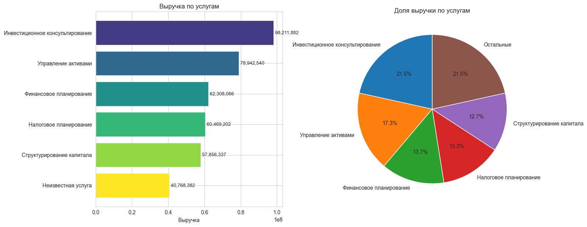
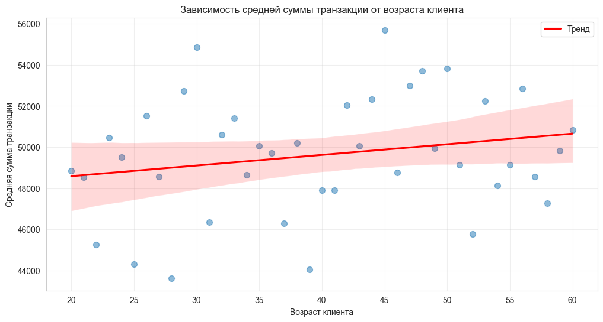
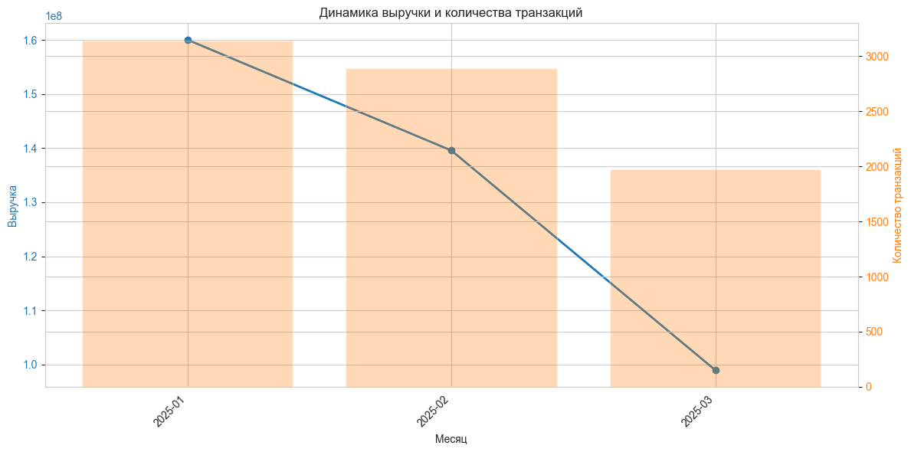

# Финансовый анализ - Отчет

**Дата отчета:** 24.02.2026 03:59:03

---

## Топ-5 услуг по количеству заказов

1. **Инвестиционное консультирование**: 1956 заказов
2. **Управление активами**: 1606 заказов
3. **Финансовое планирование**: 1242 заказов
4. **Налоговое планирование**: 1218 заказов
5. **Структурирование капитала**: 1196 заказов

## Услуга с максимальной выручкой

**Инвестиционное консультирование**: 98,211,881.70

## Средняя сумма транзакций по городам

- **Michellehaven**: 58,331.61
- **East Rachelmouth**: 57,472.97
- **Port Michellemouth**: 57,147.05
- **New Tommyborough**: 54,873.15
- **North Lauriebury**: 54,052.56
- **Trevinoberg**: 53,841.74
- **New Zacharyport**: 53,437.51
- **Johnsonfort**: 53,225.58
- **Bondstad**: 53,194.34
- **Kaneburgh**: 52,315.36
- **Lake Tina**: 52,188.31
- **Krystalland**: 52,172.46
- **Lake Arielmouth**: 52,150.43
- **North Melissaland**: 52,038.94
- **Patelbury**: 52,001.34
- **Aprilstad**: 51,518.79
- **South Andrew**: 51,234.29
- **Hamiltontown**: 50,817.98
- **West Meredithhaven**: 50,814.26
- **Harrisberg**: 50,496.75
- **Davidsonborough**: 50,406.60
- **North Emily**: 50,265.01
- **Erichaven**: 50,238.33
- **Ronaldville**: 50,203.35
- **Mayoberg**: 49,580.73
- **North Hannahmouth**: 49,557.53
- **Port Jordan**: 49,272.30
- **Port James**: 49,152.48
- **Неизвестный город**: 49,060.38
- **Dannyburgh**: 48,982.63
- **East Matthewmouth**: 48,853.46
- **New Chelseaberg**: 48,847.74
- **Tonystad**: 48,562.65
- **Karenville**: 48,526.74
- **South Thomas**: 48,330.39
- **Port Darlene**: 48,002.44
- **Cruzport**: 47,463.16
- **East Melissaville**: 47,238.19
- **North Patrickport**: 47,117.77
- **Ibarramouth**: 46,707.53
- **Davidmouth**: 46,584.84
- **West Jaymouth**: 46,560.07
- **Roberttown**: 46,471.60
- **Lake Sallychester**: 45,515.27
- **Jeanettetown**: 45,366.55
- **New Dianechester**: 45,340.04
- **Matthewsville**: 45,105.78
- **Mirandaside**: 44,115.35
- **Elizabethmouth**: 43,752.93
- **New Ryan**: 43,545.46
- **East Jamie**: 43,278.93

## Распределение по способам оплаты

- **Кредитная карта**: 40.04%
- **Банковский перевод**: 34.59%
- **Неизвестно**: 10.15%
- **Наличные**: 9.96%
- **Криптовалюта**: 5.27%

## Выручка за последний месяц

**135,241,169.50**

## Анализ по сегментам клиентов

### Высокий капитал
- Клиентов: 6750
- Выручка: 273,180,696.07
- Транзакций: 5496
- Средний чек: 49,705.37

### Средний капитал
- Клиентов: 1468
- Выручка: 58,907,244.94
- Транзакций: 1190
- Средний чек: 49,501.89

### Низкий капитал
- Клиентов: 158
- Выручка: 6,154,434.84
- Транзакций: 130
- Средний чек: 47,341.81

## Прогноз на следующий месяц

- **Транзакции**: 1515 (📉 Падение)
- **Выручка**: 72,142,381.17 (📉 Падение)
- **Качество прогноза (R²)**: 0.883 (хорошее)

## Визуализации

### Распределение сумм транзакций

### Выручка по услугам

### Зависимость средней суммы от возраста

### Динамика выручки и транзакций

### Интерактивный HTML-отчет

Открыть интерактивный отчёт в браузере: [report_metadata/analysis_report.html](report_metadata/analysis_report.html)
(ссылка доступна только при локальном размещении файла)

---

## Метаданные

- **ID отчета**: `20260224_035903`
- **JSON-данные**: `report_metadata/analysis_results_20260224_035903.json`
